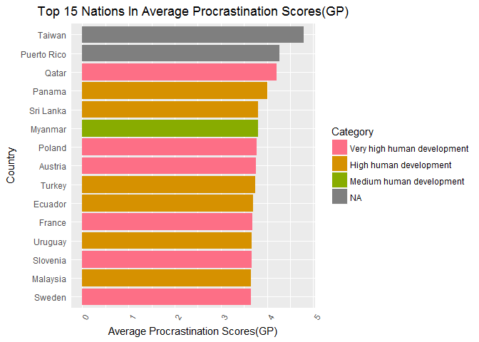

##Import of procrastination data


#### Here we are importing the procrastination data that we got from the client and get the dimension of the data.This data set has 4262 rows and 61 columns.


```r
procrastination_data <- read.csv("Data/Procrastination.csv",stringsAsFactors = FALSE)

kable(dim(procrastination_data), header = "Dimension of procrastination dataset")
```

```
## Warning in kable_markdown(x = structure(c("4264", "61"), .Dim = c(2L, 1L:
## The table should have a header (column names)
```


|     |
|----:|
| 4264|
|   61|

</br>

####We are renaming the values of the columns to limit the size of all variable names to 12 characters or less. We have a lot of questions from different questionnaires, due to the fact that we are more interested in the average score from these questionnaires we are simply going to create sequential names based on the source questionnaire. 


```r
#a function that removes all of the periods from variable names and makes the name into Camel Case form.
camel <- function(x){ #function for camel case
    capit <- function(x) paste0(toupper(substring(x, 1, 1)), substring(x, 2, nchar(x)))
    sapply(strsplit(x, "\\."), function(x) paste(capit(x), collapse=""))
}

names(procrastination_data)<-camel(names(procrastination_data))

#a manual update of variable names that are too long or not descriptive. 
procrastination_data<- rename(x=procrastination_data,replace=c("HowLongHaveYouHeldThisPositionYears"="ExpYears", "Edu"="Education",
"CountryOfResidence"="Country", 
"ÏAge"="Age",                              
"HowLongHaveYouHeldThisPositionMonths"="ExpMonths",
"DoYouConsiderYourselfAProcrastinator"="SelfQuestion",
"NumberOfDaughters" = "Daughters", 
"NumberOfSons" = "Sons",
"CurrentOccupation"="Job",
"CommunitySize"="Community",
"MaritalStatus"="Marital",
"DoOthersConsiderYouAProcrastinator"="OthQuestion",
"AnnualIncome"="Income"))

#This will rename the columns of the different questionnaires 

colnames(procrastination_data)[grep(names(procrastination_data),pattern = "GP")] <- sprintf("GPQues%d",1:length(grep(names(procrastination_data),pattern = "GP")))
colnames(procrastination_data)[grep(names(procrastination_data),pattern = "AIP")] <- sprintf("AIPQues%d",1:length(grep(names(procrastination_data),pattern = "AIP")))
colnames(procrastination_data)[grep(names(procrastination_data),pattern = "SWLS")] <- sprintf("SWLSQues%d",1:length(grep(names(procrastination_data),pattern = "SWLS")))
colnames(procrastination_data)[grep(names(procrastination_data),pattern = "DP")] <- sprintf("DPQues%d",1:length(grep(names(procrastination_data),pattern = "DP")))
```

####Cleaning up the data. This section we are eliminating values that don't make sense as well as errors that occured when the data was exported.

* There are unrealistic and null values in the years of experience data, here those values will be assigned to zero. We also round up values to only one digit.


```r
#Years of experience
#For years of experience any unrealistic value or null value is assigned 
procrastination_data$ExpYears <-as.numeric(procrastination_data$ExpYears)
procrastination_data$ExpYears[procrastination_data$ExpYears==999 | is.na(procrastination_data$ExpYears)] <- 0
procrastination_data$ExpYears <- round(procrastination_data$ExpYears,digits=1)
```

* There are zeros in the occupation data. We are replacing zeros with NA. And also there are blanks in the Income data. We are replacing them with zero.


```r
#We are replacing mis identified
procrastination_data$Job[procrastination_data$Job=="0"] <- "NA"
#Any blank income is assigned a value of 0
procrastination_data$Income[is.na(procrastination_data$Income)] <- 0
```

* Relabelling the Number of sons data. The data is labelled as Male and Female. Here we relabel the gender back to intergers with Male=1 and Female =2.


```r
procrastination_data$Sons[procrastination_data$Sons=="Male"] <- "1"
procrastination_data$Sons[procrastination_data$Sons=="Female"] <- "2"
```

* Update the kids data to only Yes and No.


```r
#The Kids data is updated to only Yes or no
procrastination_data$Kids <- ifelse(grepl(procrastination_data$Kids,pattern = "Yes"),"Yes","No") 
```

* Update the age data. We are truncating all values of age after the decimal.


```r
#We are truncating all values of age after the decimal
procrastination_data$Age <- trunc(procrastination_data$Age,digits=0)
```

* There are zero values in the contry of residence. We are replacing them with NA to treat this as missing.

```r
#This is to replace all 0 values of Country with an empty string
procrastination_data$Country[procrastination_data$Country=="0"] <- "NA"
```

* There are blanks answers under the question: Do you consider yourself a procrastinator and question:Do others consider you a procrastinator. Here we assign them a Yes value.

```r
#Any blank answers in the procrastination questionnaires are assigned a Yes value
procrastination_data$OthQuestion[procrastination_data$OthQuestion==""] <- "NA"
procrastination_data$SelfQuestion[procrastination_data$SelfQuestion==""] <- "NA"
procrastination_data$SelfQuestion[procrastination_data$SelfQuestion == '0'] <- "NA"
procrastination_data$SelfQuestion[procrastination_data$SelfQuestion == '4'] <- "NA"
```

* Creating columns for the mean of DP,AIP,GP and SWLS to represent the individual's average decisional procrastination, procrastination behavior,generalized procrastination and life satisfaction. We round the mean up to only one digit.

```r
#Here we are greping all of the variables with certain criteria in their names and creating a new variable of the mean of variables
procrastination_data$GPMean <- rowMeans(procrastination_data[,grep(names(procrastination_data),pattern = "GP")])
procrastination_data$AIPMean <- rowMeans(procrastination_data[,grep(names(procrastination_data),pattern = "AIP")])
procrastination_data$SWLSMean <- rowMeans(procrastination_data[,grep(names(procrastination_data),pattern = "SWLS")])
procrastination_data$DPMean <- rowMeans(procrastination_data[,grep(names(procrastination_data),pattern = "DP")])

#We are rounding the characters to only 1 digit after the decimal
procrastination_data$GPMean <- round(procrastination_data$GPMean,digits=1)
procrastination_data$AIPMean <- round(procrastination_data$AIPMean,digits=1)
```

* The job titles also need to be organized. 
	* In this process, any job title with 'please specify' will be assigned to a NA to be treated as missing.
	
	* All students are titled as student.
	
	* Professional job titles are being assigned to a more general term, i.e. yoga teacher and ESL teacher were simplified to teacher.
	
	* Everyone with a job status of Unemployed with a blank occupation is assigned the value Unemployed for their occupation 
	
	* All Job titles under 5 characters were made to an empty string.
	
	* All jobs with a slash(/) had all text after the slash removed.
	
	* All jobs with parantheses had the parantheses removed.
	
	* All jobs with leading and trailing white space were trimmed.
	

```r
#Any job title where the person filled in please specify is made into an empty string.
procrastination_data$Job[grep(procrastination_data$Job,pattern = "please specify")] <- "NA"

#All students are titled as student. As well if someone put their work status as Student then their occupation was updated to student
procrastination_data$Job[grep(procrastination_data$WorkStatus,pattern = "[sS]tudent")] <- "Student"
procrastination_data$Job[grep(procrastination_data$Job,pattern = "[sS]tudent")] <- "Student"

#These are statements to make professional job titles more general, i.e. yoga teacher and ESL teacher were simplified to teacher
procrastination_data$Job[grep(procrastination_data$Job,pattern = "[tT]eacher")] <- "Teacher"
procrastination_data$Job[grep(procrastination_data$Job,pattern = "[wW]riter")] <- "Writer"
procrastination_data$Job[grep(procrastination_data$Job,pattern = "RN|[nN]urse|LPN|PCA")] <- "Nurse"
procrastination_data$Job[grep(procrastination_data$Job,pattern = "[cC][ ]*[eE][ ]*[oO]")] <- "Chief Executive"
procrastination_data$Job[grep(procrastination_data$Job,pattern = "IT")] <- "Information Technology"
procrastination_data$Job[grep(procrastination_data$Job,pattern = "[dD]octor|[mM][dD]")] <- "Doctor"
procrastination_data$Job[grep(procrastination_data$Job,pattern = "[sS]ales")] <- "Sales"
procrastination_data$Job[grep(procrastination_data$Job,pattern = "[Aa]cademic")] <- "Academic"

procrastination_data$Job[grep(procrastination_data$Job,pattern = "[Aa]dmin")] <- "Administration"
procrastination_data$Job[grep(procrastination_data$Job,pattern = "[Aa]nalyst")] <- "Analyst"
procrastination_data$Job[grep(procrastination_data$Job,pattern = "[Aa]rt")] <- "Art"
procrastination_data$Job[grep(procrastination_data$Job,pattern = "[Aa]ssist")] <- "Assistant"
procrastination_data$Job[grep(procrastination_data$Job,pattern = "[Aa]ttor")] <- "Attorney"
procrastination_data$Job[grep(procrastination_data$Job,pattern = "[Bb]usiness")] <- "Business"
procrastination_data$Job[grep(procrastination_data$Job,pattern = "[Cc]linical")] <- "Clinical"
procrastination_data$Job[grep(procrastination_data$Job,pattern = "[Cc]ommunications")] <- "Communication"
procrastination_data$Job[grep(procrastination_data$Job,pattern = "[Cc]omputer")] <- "Computer"
#Everyone with a job status of Unemployed with a blank occupation is assigned the value Unemployed for their occupation 
procrastination_data$Job[procrastination_data$WorkStatus=="unemployed"& procrastination_data$Job==""] <- "Unemployed"

#All Job titles under 5 characters were made to an empty string
procrastination_data$Job[nchar(procrastination_data$Job)<5] <- ""

#All jobs with a slash(/) had all text after the slash removed
procrastination_data$Job<-sub("\\s*/.*", "", procrastination_data$Job)

#All jobs with parantheses had the parantheses removed
procrastination_data$Job<-sub("\\s*\\(.*", "", procrastination_data$Job)

#All jobs with leading and trailing white space were trimmed
procrastination_data$Job<-gsub("^\\s+|\\s+$", "", procrastination_data$Job)
```

* There are blanks in Gender data. We are replacing blanks with NA.


```r
procrastination_data$Gender[procrastination_data$Gender ==""] <- "NA"
```

* There are blanks in Working Status. We are replacing blanks with NA.

```r
procrastination_data$WorkStatus[procrastination_data$WorkStatus ==""] <- "NA"
```
##Scraping wikipedia

####We are pulling data from the Human Development Index page on Wikipedia. We will combine this data from different tables and assign it a category value based on the HDI score.


```r
#This is a function to combine multiple tables of scraped data that share a similar category
bindData <- function(firstframe,dataset,category){
	
#Here we are assigning the columns we need to some temporary variables and renaming the columns
working_temp <- dataset[[firstframe]][2:nrow(dataset[[firstframe]]),c(3,4)]
names(working_temp)<-c("Country","HDI")
working_temp1 <- dataset[[firstframe+1]][2:nrow(dataset[[firstframe+1]]),c(3,4)]
names(working_temp1)<-c("Country","HDI")

#We are binding the rows of our two temp variables and adding the Category value.
working_temp<-rbind(working_temp,working_temp1)
working_temp<-cbind(working_temp,"Category"=category)
}

url <- "https://en.wikipedia.org/wiki/List_of_countries_by_Human_Development_Index"

HDI_table <- url %>%
  read_html() %>%  
  html_nodes("table")%>%
html_table(fill=TRUE)

HDI <- data.frame("Country","HDI","Category")

HDI<-rbind(bindData(4,HDI_table,"Very high human development"),
           bindData(7,HDI_table,"High human development"),
           bindData(10,HDI_table,"Medium human development"),
           bindData(13,HDI_table,"Low human development"))
```

####Merging our procrastination data to the HDI data pulled from Wikipedia. 

```r
#We are doing a left merge of the procrastination data on the HDI data pulled from wikipedia. This means that if there is a missing country value from the procrastination data we will still bring that data over with missing HDI information.
merged_data<-merge(x=procrastination_data,y=HDI,by="Country",all.x=TRUE)
```

####Our client wants us to only study subjects over the age of 18 so we are selecting a subset of only ages that we can confirm are over the age of 18.

```r
cleaned_data <- merged_data[merged_data$Age>18 & !is.na(merged_data$Age),]
```

####Presented below are the descriptive statistics on Age, Income, HDI, and for mean columns of GP,AIP,SWLS,DP.There are two histograms for Age and Mean GP data. The histogram for Age is right skewed while the histogram for Mean GP is more symmetrical and bell shaped.


```r
agesummary <- summary(cleaned_data$Age)
incomesummary <-summary(cleaned_data$Income)
HDIsummary <- summary(cleaned_data$HDI)

agesummary
```

```
##    Min. 1st Qu.  Median    Mean 3rd Qu.    Max. 
##   19.00   28.00   37.00   38.14   45.00   80.00
```

```r
incomesummary
```

```
##    Min. 1st Qu.  Median    Mean 3rd Qu.    Max. 
##       0   10000   35000   53723   67500  250000
```

```r
HDIsummary
```

```
##    Length     Class      Mode 
##      4036 character character
```

```r
meanGPsummary <- summary(cleaned_data$GPMean)
meanAIPSsummary <-summary(cleaned_data$AIPMean)
meanSWLsummary <-summary(cleaned_data$SWLSMean)
meanDPsummary <- summary(cleaned_data$DPMean)

meanGPsummary 
```

```
##    Min. 1st Qu.  Median    Mean 3rd Qu.    Max. 
##   1.000   2.800   3.200   3.235   3.800   5.000
```

```r
meanAIPSsummary
```

```
##    Min. 1st Qu.  Median    Mean 3rd Qu.    Max. 
##   1.000   2.400   2.900   2.964   3.500   5.000
```

```r
meanSWLsummary 
```

```
##    Min. 1st Qu.  Median    Mean 3rd Qu.    Max. 
##   1.000   2.400   3.000   3.047   3.800   5.000
```

```r
meanDPsummary 
```

```
##    Min. 1st Qu.  Median    Mean 3rd Qu.    Max. 
##   1.000   2.400   3.000   3.052   3.800   5.000
```

```r
#histogram of age
qplot(cleaned_data$Age, 
			geom="histogram",
      binwidth = 2,  
      main = "Histogram for Age", 
      xlab = "Age",  
      fill=I("light blue"), 
      col=I("red"))+
	theme(plot.title=element_text(hjust = .5), axis.ticks.y=element_blank(),axis.ticks.x=element_blank()) +
  theme(axis.text.x = element_text(angle=60,hjust=1))
```

<!-- -->

```r
#histogram of mean GP
qplot(cleaned_data$GPMean, 
			geom="histogram",
      binwidth = 0.1,  
      main = "Histogram for Mean GP", 
      xlab = "Mean GP",  
      fill=I("light blue"), 
      col=I("red"))+
	theme(plot.title=element_text(hjust = .5), axis.ticks.y=element_blank(),axis.ticks.x=element_blank()) +
  theme(axis.text.x = element_text(angle=60,hjust=1))
```

<!-- -->

####Presented below is a table of the number count of the participants in the survey by genders.

```r
frequencyOfRespondantsByGender <- as.data.frame(table(cleaned_data$Gender))
colnames(frequencyOfRespondantsByGender) <- c("Gender","Number of Participants")
kable(frequencyOfRespondantsByGender[order(-frequencyOfRespondantsByGender$`Number of Participants`),],row.names = FALSE)
```


Gender    Number of Participants
-------  -----------------------
Female                      2309
Male                        1721
NA                             6


####Presented below is a table of the number count of the participants in the survey by Work Status.

```r
frequencyOfRespondantsByWork <- as.data.frame(table(cleaned_data$WorkStatus))
colnames(frequencyOfRespondantsByWork) <- c("WorkStatus","Number of Participants")
kable(frequencyOfRespondantsByWork[order(-frequencyOfRespondantsByWork$`Number of Participants`),],row.names = FALSE)
```


WorkStatus    Number of Participants
-----------  -----------------------
full-time                       2260
student                          837
part-time                        465
unemployed                       258
retired                          174
NA                                42

####Presented below is a table of the number count of the participants in the survey by Occupation.


```r
frequencyOfRespondantsByJob<- as.data.frame(table(cleaned_data$Job))
colnames(frequencyOfRespondantsByJob) <- c("Job","Number of Participants")
kable(frequencyOfRespondantsByJob[order(-frequencyOfRespondantsByJob$`Number of Participants`),],row.names = FALSE)
```


Job                                         Number of Participants
-----------------------------------------  -----------------------
                                                              1826
Student                                                        845
Unemployed                                                     155
Teacher                                                         88
Attorney                                                        53
college professor                                               42
Writer                                                          41
Analyst                                                         40
engineer                                                        32
Assistant                                                       31
manager                                                         31
retired                                                         28
Administration                                                  24
Information Technology                                          24
Editor                                                          21
Nurse                                                           21
Marketing                                                       20
Doctor                                                          19
Sales                                                           18
houswife                                                        15
Software Developer                                              14
Business                                                        12
Scientist                                                       12
consultant                                                      11
Financial Advisor                                               11
home maker                                                      11
Computer                                                        10
director                                                        10
Graphic Designer                                                10
Librarian                                                        9
Customer Service                                                 8
Research Scientist                                               8
President                                                        7
psychologis                                                      7
Social Worker                                                    7
Academic                                                         6
Journalist                                                       6
Project Manager                                                  6
Server                                                           6
Translator                                                       6
Chief Executive                                                  5
Finance                                                          5
Pastor ; Life coach  clergy                                      5
Architect                                                        4
Communication                                                    4
operations manager                                               4
Programmer                                                       4
project manager                                                  4
Research Associate                                               4
Web Designer                                                     4
Deputy Director                                                  3
Human Resource Manager                                           3
Insurance Agent                                                  3
law enforcement                                                  3
Musician                                                         3
Pharmacist                                                       3
psychotherapist                                                  3
Receptionist                                                     3
researcher                                                       3
secretary                                                        3
Accountant                                                       2
Accounting                                                       2
Accounting Manager                                               2
Accounts Payable                                                 2
associate                                                        2
Bank Teller                                                      2
banker                                                           2
bookkeeper                                                       2
Chief of Staff                                                   2
clerk                                                            2
Clinical                                                         2
Consumer Case Coordinator                                        2
Counselor                                                        2
Creative Director                                                2
dentist                                                          2
designer                                                         2
Designer                                                         2
Diplomat                                                         2
Epidemiologist                                                   2
Executive Director                                               2
Geologist                                                        2
Information Technology Consultant                                2
Insurance                                                        2
journalist                                                       2
lecturer                                                         2
letter carrier                                                   2
Library technician                                               2
Medical                                                          2
Network Engineer                                                 2
Office Manager                                                   2
Owner                                                            2
Paralegal                                                        2
Paraprofessional                                                 2
Postdoc                                                          2
Press Officer                                                    2
Retail                                                           2
self-employed Photographer                                       2
Self Employed                                                    2
Software engineer                                                2
Software Pro                                                     2
stocker                                                          2
Supervisor                                                       2
Tutor                                                            2
university faculty                                               2
vice-president                                                   2
Account Manager                                                  1
account planner                                                  1
Account Service Rep                                              1
Activities Leader                                                1
Actress                                                          1
acupuncturist                                                    1
adjunct faculty                                                  1
adult care                                                       1
advocate                                                         1
Agronomist                                                       1
airline                                                          1
airport ground handler                                           1
anthropologist                                                   1
Antique Dealer                                                   1
Associate                                                        1
associate at law firm                                            1
Associate director                                               1
Associate Director                                               1
Associate Producer                                               1
Asst. Prof.                                                      1
Astrohysicist                                                    1
audio engineer                                                   1
Aviation Specialist                                              1
Bar & Restaurant Owner                                           1
Biologist                                                        1
Box Office Representative                                        1
Braillist                                                        1
BUSINESS CONSULTA                                                1
buyer                                                            1
CAD operator                                                     1
CAD Technician                                                   1
Camera Coordinator                                               1
Campus Planner                                                   1
Capstone Golf Course                                             1
Career Placement Associate                                       1
Case Manager                                                     1
Casting Director                                                 1
chairman of the board                                            1
chauffeur                                                        1
Chief Financial Officer                                          1
Chiefe Development Engineer                                      1
chiropractor                                                     1
civil servant                                                    1
Civil servant                                                    1
Clutter clearer,  video editor, caterer                          1
Co-Proprietor                                                    1
Collection management specialist                                 1
college faculty                                                  1
company director                                                 1
Consultant and entrepreneur                                      1
Consulting Manager                                               1
Controller                                                       1
Contsuruction Management                                         1
Coordinator of International Programs                            1
coordinatore operativo                                           1
copy supervisor                                                  1
Corporate instructor                                             1
Corporate Trainer                                                1
Corporation President                                            1
Corrections                                                      1
Country Style Employee                                           1
Creative Consultant                                              1
Data Warehouse Engineer                                          1
Dealer                                                           1
Dental & Disability Coordinator                                  1
Dept. Director                                                   1
Deputy Chief of Public Information for t                         1
Deputy Chieif Information Officer                                1
deputy practice manager                                          1
Developer                                                        1
Dietitian                                                        1
Director                                                         1
Director of a language program                                   1
Director of Contract Management                                  1
Director of non-profit organization                              1
Director of Software Company                                     1
Director Operations                                              1
Director,social Dvelopment                                       1
Disability Allowance                                             1
Dish Washer                                                      1
Divisional Manager of a large cosmetics                          1
Driver                                                           1
Ecology technician                                               1
Economist                                                        1
Economy                                                          1
Education                                                        1
Education Specialist                                             1
EHS Manager                                                      1
election services                                                1
Electrical Technician                                            1
electronic technician                                            1
employed by a church                                             1
energy therapist                                                 1
enologist                                                        1
entertainer                                                      1
entrepreneur                                                     1
Entrepreneur & Consultant                                        1
environmental education non profit direc                         1
Environmental Engineer                                           1
Environmental Senior Specialist                                  1
Executive                                                        1
Executive officer                                                1
Executive Vice President                                         1
Facilitator                                                      1
Facilities Management                                            1
Farm Manager                                                     1
federal excise tax auditor                                       1
Field Coordinator                                                1
film editor                                                      1
Film Industry                                                    1
Film maker                                                       1
Financial Consultant                                             1
Financial Controller                                             1
financial officer                                                1
financial risk manager                                           1
First VP & Associate General Counsel                             1
Fitness Instructor                                               1
flight surgeon                                                   1
Food Service Supervisor                                          1
Foreign Affairs Specialist                                       1
free lance bookkeeper                                            1
Free lance editor and tutor--in theory                           1
free professionist                                               1
Freelance                                                        1
Freelance Project Manager                                        1
Gender                                                           1
Geophysicist                                                     1
Gove service                                                     1
Head - Operations & QA                                           1
health care                                                      1
Healthcare Consultant                                            1
hostess                                                          1
Hotel Desk Clerk                                                 1
Housekeeping                                                     1
HR generalist                                                    1
Human Resource Manger                                            1
HVAC Tech                                                        1
ICT Director                                                     1
In-house Legal Counsel                                           1
information assisstant                                           1
Information Developer                                            1
Information Management                                           1
Information technology                                           1
innkeeper                                                        1
instructor                                                       1
insurance agent                                                  1
Insurance Claims Supervisor                                      1
Insurance Coordinator                                            1
Internet & media consultant                                      1
Internship                                                       1
interpreter                                                      1
Investigative Specialist                                         1
investment banker                                                1
Investment Counsel                                               1
ISTraining Coordinator                                           1
Janitor                                                          1
Juvenile Corrections Officer                                     1
Lab Director                                                     1
Labor Relations Specialist                                       1
laboratory technician                                            1
land use planner                                                 1
landscape designer                                               1
Language Service Provider                                        1
language trainer                                                 1
Law clerk                                                        1
Legal Secretary                                                  1
library paraprofessional                                         1
Licensed Professional Counselor                                  1
maintenance tech.                                                1
Management consultant                                            1
Management Consultant & Entrepreneur                             1
Manager - Analytical and Environmental S                         1
Manager,Interacitve Media                                        1
manufacturing                                                    1
Master Control Operator                                          1
Mechanical Engineer                                              1
Media Consultant                                                 1
media relations                                                  1
Media Relations Manager                                          1
Medical Laboratory                                               1
Medical Practitioner                                             1
medical sonographer                                              1
Mentor                                                           1
Military                                                         1
Multimedia Developer                                             1
museum docent                                                    1
Network Services Engineer                                        1
new realtor                                                      1
newspaper carrier                                                1
Night Dispatch Supervisor                                        1
Non-profit Consultant                                            1
nursing home                                                     1
office                                                           1
Office Services Manager                                          1
Organic Grocery Store Cashier                                    1
Outdoor Recreation Coordinator                                   1
owner - private practice physical therap                         1
P-T College Faculty & P-T Self-Employed                          1
Page Designer for a newspaper                                    1
Parent Educator                                                  1
pathology                                                        1
pharmacy tech.                                                   1
photo profucer                                                   1
physician                                                        1
Physicist                                                        1
Physiotherapst                                                   1
pjublic relations director                                       1
Plant Engineering Supervisor                                     1
Please specify title Manager for Regulat                         1
President Nongovernmental organization                           1
Private Equity Principal                                         1
pro poker player                                                 1
Probation Supervisor                                             1
Process Engineer                                                 1
Procrastinator                                                   1
producer                                                         1
Product Field Test Manager                                       1
Professional Organizer                                           1
Program Coordinator                                              1
Program Director                                                 1
Program director at a non-profit organiz                         1
Program Manager                                                  1
Program Manager and Acting Director                              1
Program officer                                                  1
Program Specialist                                               1
Proofreader                                                      1
Proposal Director                                                1
Psychiatrist in Private Practice                                 1
Public Health                                                    1
public relations                                                 1
Publishing                                                       1
Quality Manager                                                  1
Quotations specialist                                            1
real estate                                                      1
real estate agent                                                1
Real Estate Appraiser                                            1
real estate broker                                               1
Real estate developer                                            1
realtor                                                          1
Recreational Staff                                               1
Registered Respiratory Therapist                                 1
regulatory affairs                                               1
research coordinator                                             1
Research manager                                                 1
research specialist                                              1
research technician                                              1
Researcher - Physician                                           1
resident physician                                               1
Residential Services Supervisor                                  1
Respiratory Therapist                                            1
Restaurant operations manager                                    1
rocket scientist                                                 1
School Counselor                                                 1
Science writing intern                                           1
Secretary                                                        1
Self-Employed                                                    1
Self-employed Family Therapist                                   1
self-employed translator                                         1
self employed                                                    1
Self employed Public Relations                                   1
self employeed                                                   1
selfemplyed renovator                                            1
senior consultant                                                1
Senior Grant Officer                                             1
Senior Human Resources Consultant                                1
Senior Policy Advisor                                            1
senior project manager                                           1
Service co-ordinator                                             1
Service Registrar                                                1
set designer                                                     1
set lighting technician                                          1
Shipping                                                         1
Social Media consultant                                          1
Software trainer                                                 1
Speaker                                                          1
Speaker Author Consultant                                        1
Special Projects Editor                                          1
specialist                                                       1
Sr. Drug Safety Associate                                        1
Statistician                                                     1
Stay-at-home dad                                                 1
steamship agent                                                  1
supervising program development speciali                         1
supervisor shelderd workshop for handcap                         1
Surgeon                                                          1
Surgical Resident                                                1
system manager                                                   1
tax consultant                                                   1
Tax Examiner                                                     1
Technical Coordinator                                            1
Technical director                                               1
Technical officer                                                1
Technical support rep                                            1
Technical Trainer                                                1
Technology                                                       1
Technology Curriculum Developer Science                          1
television director                                              1
Television Producer                                              1
temporary office                                                 1
Theater General Manager                                          1
Town Clerk                                                       1
Town Planner                                                     1
trader                                                           1
Traffic Reporter-Radio                                           1
trainee                                                          1
training Coordinator                                             1
Training Coordinator                                             1
treatment support co-ordinator                                   1
TV BROADCAST TECHNICIAN                                          1
TV News Executive Producer                                       1
University Staff                                                 1
Urban Planner                                                    1
veterinarian                                                     1
Vetrans Representative                                           1
vice president                                                   1
Vice President                                                   1
Volunteer Director                                               1
VP Scientific Affairs                                            1
warehouse                                                        1
Warehouse Supervisor                                             1
Webmaster                                                        1
wig designer                                                     1

####Presented below is a table of the number count of the participants in the survey per country.

```r
cleaned_data$Country[cleaned_data$Country==""] <- "NA"
frequencyOfRespondantsByCountry <- as.data.frame(table(cleaned_data$Country))
colnames(frequencyOfRespondantsByCountry) <- c("Country","Number of Participants")
kable(frequencyOfRespondantsByCountry[order(-frequencyOfRespondantsByCountry$`Number of Participants`),],row.names = FALSE)
```


Country               Number of Participants
-------------------  -----------------------
United States                           2785
Canada                                   243
United Kingdom                           177
NA                                       160
Australia                                 99
India                                     78
Italy                                     62
Germany                                   36
Brazil                                    20
Ireland                                   19
Isreal                                    19
Netherlands                               18
Sweden                                    15
Norway                                    14
France                                    13
Japan                                     13
Spain                                     13
China                                     12
Finland                                   12
Mexico                                    12
New Zealand                               12
South Africa                              12
Switzerland                               12
Philippines                               11
Greece                                    10
Belgium                                    9
Denmark                                    9
Turkey                                     9
Hong Kong                                  7
Portugal                                   7
Slovenia                                   6
Poland                                     5
Romania                                    5
Afghanistan                                4
Chile                                      4
Croatia                                    4
Malaysia                                   4
Singapore                                  4
Algeria                                    3
Argentina                                  3
Austria                                    3
Czech Republic                             3
Ecuador                                    3
Puerto Rico                                3
Uruguay                                    3
Albania                                    2
Andorra                                    2
Bermuda                                    2
Bulgaria                                   2
Columbia                                   2
Ghana                                      2
Iran                                       2
Malta                                      2
Peru                                       2
Saudi Arabia                               2
South Korea                                2
Thailand                                   2
Ukraine                                    2
Venezuela                                  2
Yugoslavia                                 2
Antigua                                    1
Bahamas                                    1
Barbados                                   1
Bolivia                                    1
Botswana                                   1
Brunei                                     1
Cyprus                                     1
Dominican Republic                         1
Egypt                                      1
El Salvador                                1
Guam                                       1
Guyana                                     1
Hungary                                    1
Iceland                                    1
Jamaica                                    1
Kazakhstan                                 1
Kenya                                      1
Lithuania                                  1
Luxembourg                                 1
Macao                                      1
Macedonia                                  1
Morocco                                    1
Myanmar                                    1
Nicaragua                                  1
Pakistan                                   1
Panama                                     1
Qatar                                      1
Russia                                     1
Sri Lanka                                  1
Taiwan                                     1
Vietnam                                    1

####Presented below is a total number of the matched answers from question: whether the person considers themselves a procrastinator and question: whether others consider them a procrastinator. There are 2846 people matched their perceptions to others.


```r
cleaned_data$matching <- ifelse(cleaned_data$SelfQuestion ==cleaned_data$OthQuestion,1,0)
matched <-sum(cleaned_data$matching)
matched 
```

```
## [1] 2846
```

####Presented below is a barchart displaying the top 15 nations in average procrastination scores using the measure of the GP score.


```r
top15 <- aggregate(cleaned_data$GPMean,list(cleaned_data$Country),mean)
names(top15) <- c("Country", "GPMean")

merged15 <- merge(x=top15,y=HDI,by='Country',all.x =TRUE)

merged15<- merged15[with(merged15,order(-GPMean)),]
merged15 <- merged15[1:15,]
merged15
```

```
##        Country   GPMean   HDI                    Category
## 82      Taiwan 4.800000  <NA>                        <NA>
## 69 Puerto Rico 4.266667  <NA>                        <NA>
## 70       Qatar 4.200000 0.856 Very high human development
## 64      Panama 4.000000 0.788      High human development
## 57     Myanmar 3.800000 0.556    Medium human development
## 79   Sri Lanka 3.800000 0.766      High human development
## 67      Poland 3.780000 0.855 Very high human development
## 8      Austria 3.766667 0.893 Very high human development
## 84      Turkey 3.744444 0.767      High human development
## 27     Ecuador 3.700000 0.739      High human development
## 31      France 3.684615 0.897 Very high human development
## 75    Slovenia 3.666667 0.890 Very high human development
## 88     Uruguay 3.666667 0.795      High human development
## 53    Malaysia 3.650000 0.789      High human development
## 80      Sweden 3.646667 0.913 Very high human development
```

```r
ggplot(merged15, aes(reorder(Country, GPMean),GPMean)) + 
			geom_bar(stat="identity", aes(fill=HDI))+  scale_fill_hue(h = c(5, 100)) +
			ggtitle('Barchart: Top 15 Nations In Average Procrastination Scores(GP)')+
			ylab('Average Procrastination Scores(GP)')+ 
			xlab('Country')+

			theme(plot.title=element_text(hjust = .5), axis.ticks.y=element_blank(),axis.ticks.x=element_blank()) +
  		theme(axis.text.x = element_text(angle=60,hjust=1))
```

<!-- -->

####Presented below is a barchart displaying the top 15 nations in average procrastination scores using the measure of the AIP score.


```r
AIPtop15 <- aggregate(cleaned_data$AIPMean,list(cleaned_data$Country),mean)
names(AIPtop15) <- c("Country", "AIPMean")

AIPmerged15 <- merge(x=AIPtop15,y=HDI,by='Country',all.x =TRUE)

AIPmerged15<- AIPmerged15[with(AIPmerged15,order(-AIPMean)),]
AIPmerged15<- AIPmerged15[1:15,]
AIPmerged15
```

```
##               Country  AIPMean   HDI                    Category
## 51              Macao 4.600000  <NA>                        <NA>
## 82             Taiwan 4.600000  <NA>                        <NA>
## 26 Dominican Republic 4.500000 0.722      High human development
## 23             Cyprus 4.400000 0.856 Very high human development
## 70              Qatar 4.100000 0.856 Very high human development
## 64             Panama 4.000000 0.788      High human development
## 69        Puerto Rico 4.000000  <NA>                        <NA>
## 39            Iceland 3.900000 0.921 Very high human development
## 27            Ecuador 3.733333 0.739      High human development
## 21           Columbia 3.700000  <NA>                        <NA>
## 48              Kenya 3.700000 0.555    Medium human development
## 79          Sri Lanka 3.700000 0.766      High human development
## 84             Turkey 3.677778 0.767      High human development
## 88            Uruguay 3.600000 0.795      High human development
## 31             France 3.561538 0.897 Very high human development
```

```r
ggplot(AIPmerged15, aes(reorder(Country, AIPMean),AIPMean)) + 
			geom_bar(stat="identity", aes(fill=HDI))+  scale_fill_hue(h = c(5, 100)) +
			ggtitle('Barchart: Top 15 Nations In Average Procrastination Scores(AIP)')+
			ylab('Average Procrastination Scores(AIP)')+ 
			xlab('Country')+

			theme(plot.title=element_text(hjust = .5), axis.ticks.y=element_blank(),axis.ticks.x=element_blank()) +
  		theme(axis.text.x = element_text(angle=60,hjust=1))
```

<!-- -->


####Presented below is a table displaying nations show up both in GP and AIP plot.


```r
countrymatching<-intersect(merged15$Country,AIPmerged15$Country)
countrymatching <- data.frame(countrymatching)
names(countrymatching) <- c('CountryInBoth')
countrymatching
```

```
##   CountryInBoth
## 1        Taiwan
## 2   Puerto Rico
## 3         Qatar
## 4        Panama
## 5     Sri Lanka
## 6        Turkey
## 7       Ecuador
## 8        France
## 9       Uruguay
```

####Presented below is to show the relationship between Age and Income.


```r
#scatter plot

#linear regression
AgeIncome <- lm(Income~Age,data = cleaned_data)
```

